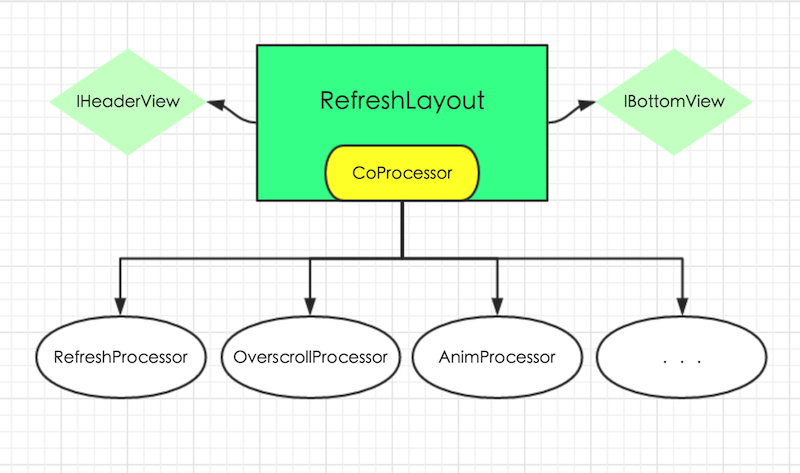
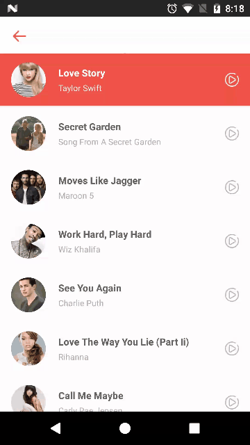
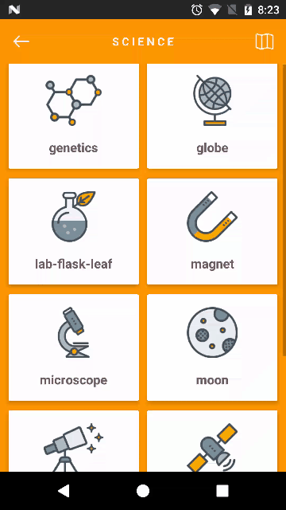
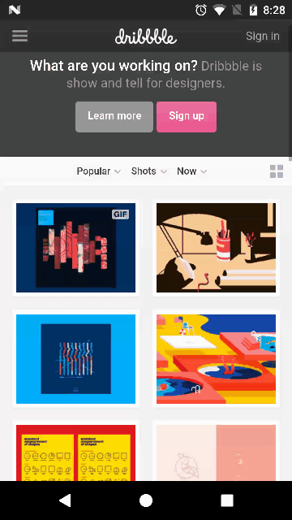

# TwinklingRefreshLayout
TwinklingRefreshLayout延伸了Google的SwipeRefreshLayout的思想,不在列表控件上动刀,而是使用一个ViewGroup来包含列表控件,以保持其较低的耦合性和较高的通用性。其主要特性有：

1. 支持RecyclerView、ScrollView、AbsListView系列(ListView、GridView)、WebView以及其它可以获取到scrollY的控件
2. 支持加载更多
3. 默认支持 **越界回弹**，随手势速度有不同的效果
4. 可开启没有刷新控件的纯净越界回弹模式
5. setOnRefreshListener中拥有大量可以回调的方法
6. 将Header和Footer抽象成了接口,并回调了滑动过程中的系数,方便实现个性化的Header和Footer



## Demo
[下载Demo](art/app-debug.apk)

        

You can download the Video for more details.

- [Music - ListView - FixedHeader](art/gif_listview.mp4)
- [Food - RecyclerView - PureScrollMode](art/gif_recyclerview.mp4)
- [Science - GridView - SinaHeader](art/gif_gridview.mp4)
- [Photo - RecyclerView - BezierLayout](art/gif_recyclerview2.mp4)
- [Story - ScrollView - GoogleDotView](art/gif_scrollview.mp4)
- [Dribbble - WebView - FloatRefresh](art/gif_webview.mp4)

## 使用方法
#### 1.添加gradle依赖
将libray模块复制到项目中,或者直接在build.gradle中依赖:
```
compile 'com.lcodecorex:tkrefreshlayout:1.0.5'
```

#### 2.在xml中添加TwinklingRefreshLayout
```xml
<?xml version="1.0" encoding="utf-8"?>
<com.lcodecore.tkrefreshlayout.TwinklingRefreshLayout xmlns:android="http://schemas.android.com/apk/res/android"
    xmlns:app="http://schemas.android.com/apk/res-auto"
    android:id="@+id/refreshLayout"
    android:layout_width="match_parent"
    android:layout_height="match_parent"
    app:tr_wave_height="180dp"
    app:tr_head_height="100dp">

    <android.support.v7.widget.RecyclerView
        android:id="@+id/recyclerview"
        android:layout_width="match_parent"
        android:layout_height="match_parent"
        android:overScrollMode="never"
        android:background="#fff" />
</com.lcodecore.library.TwinklingRefreshLayout>
```

Android系统为了跟iOS不一样，当界面OverScroll的时候会显示一个阴影。为了达到更好的显示效果，最好禁用系统的overScroll，如上给RecyclerView添加`android:overScrollMode="never"`。

#### 3.在Activity或者Fragment中配置
##### TwinklingRefreshLayout不会自动结束刷新或者加载更多，需要手动控制
```java
refreshLayout.setOnRefreshListener(new RefreshListenerAdapter(){
            @Override
            public void onRefresh(final TwinklingRefreshLayout refreshLayout) {
                new Handler().postDelayed(new Runnable() {
                    @Override
                    public void run() {
                        refreshLayout.finishRefreshing();
                    }
                },2000);
            }

            @Override
            public void onLoadMore(final TwinklingRefreshLayout refreshLayout) {
                new Handler().postDelayed(new Runnable() {
                    @Override
                    public void run() {
                        refreshLayout.finishLoadmore();
                    }
                },2000);
            }
        });
    }
```
使用finishRefreshing()方法结束刷新，finishLoadmore()方法结束加载更多。此处OnRefreshListener还有其它方法，可以选择需要的来重写。

如果你想进入到界面的时候主动调用下刷新，可以调用startRefresh()/startLoadmore()方法。

##### setWaveHeight、setHeaderHeight、setBottomHeight、setOverScrollHeight
- setWaveHeight 设置头部可拉伸的最大高度。
- setHeaderHeight 头部固定高度(在此高度上显示刷新状态)
- setBottomHeight 底部高度
- setOverScrollHeight 设置最大的越界高度

#### setEnableRefresh、setEnableLoadmore
灵活的设置是否禁用上下拉。

##### setHeaderView(IHeaderView headerView)、setBottomView(IBottomView bottomView)
设置头部/底部个性化刷新效果，头部需要实现IHeaderView，底部需要实现IBottomView。

#### setEnableOverScroll
是否允许越界回弹。

##### setOverScrollTopShow、setOverScrollBottomShow、setOverScrollRefreshShow
是否允许在越界的时候显示刷新控件，默认是允许的，也就是Fling越界的时候Header或Footer照常显示，反之就是不显示；可能有特殊的情况，刷新控件会影响显示体验才设立了这个状态。

##### setPureScrollModeOn()
开启纯净的越界回弹模式，也就是所有刷新相关的View都不显示，只显示越界回弹效果

##### setAutoLoadMore
是否在底部越界的时候自动切换到加载更多模式

##### addFixedExHeader
添加一个固定在顶部的Header(效果还需要优化)

##### startRefresh、startLoadMore、finishRefreshing、finishLoadmore

##### setFloatRefresh(boolean)
支持切换到像SwipeRefreshLayout一样的悬浮刷新模式了。

#### 4.扩展属性
- tr_wave_height 头部拉伸允许的最大高度
- tr_head_height  头部高度
- tr_bottom_height 底部高度
- tr_overscroll_height 允许越界的最大高度
- tr_enable_loadmore 是否允许加载更多,默认为true
- tr_pureScrollMode_on 是否开启纯净的越界回弹模式
- tr_overscroll_top_show - 否允许顶部越界时显示顶部View
- tr_overscroll_bottom_show 是否允许底部越界时显示底部View
- tr_enable_overscroll 是否允许越界回弹


## 其它说明
### 1.默认支持越界回弹，并可以随手势越界不同的高度
这一点很多类似SwipeRefreshLayout的刷新控件都没有做到(包括SwipeRefreshLayout),因为没有拦截下来的时间会传递给列表控件，而列表控件的滚动状态很难获取。解决方案就是给列表控件设置了OnTouchListener并把事件交给GestureDetector处理,然后在列表控件的OnScrollListener中监听View是否滚动到了顶部(没有OnScrollListener的则采用延时监听策略)。

### 2.setOnRefreshListener大量可以回调的方法
- onPullingDown(TwinklingRefreshLayout refreshLayout, float fraction)  正在下拉的过程
- onPullingUp(TwinklingRefreshLayout refreshLayout, float fraction)    正在上拉的过程
- onPullDownReleasing(TwinklingRefreshLayout refreshLayout, float fraction)  下拉释放过程
- onPullUpReleasing(TwinklingRefreshLayout refreshLayout, float fraction)  上拉释放过程
- onRefresh(TwinklingRefreshLayout refreshLayout)  正在刷新
- onLoadMore(TwinklingRefreshLayout refreshLayout)  正在加载更多

其中fraction表示当前下拉的距离与Header高度的比值(或者当前上拉距离与Footer高度的比值)。

### 3.Header和Footer
##### BezierLayout(pic 4)
- setWaveColor
- setRippleColor

##### GoogleDotView(pic 5)
##### SinaRefreshView(pic 3)
- setArrowResource
- setTextColor
- setPullDownStr
- setReleaseRefreshStr
- setRefreshingStr

##### ProgressLayout(SwipeRefreshLayout pic 6)
- setProgressBackgroundColorSchemeResource(@ColorRes int colorRes)
- setProgressBackgroundColorSchemeColor(@ColorInt int color)
- setColorSchemeResources(@ColorRes int... colorResIds)

####Footer
##### BottomProgressView(pic 2)
- setNormalColor(@ColorInt int color)
- setAnimatingColor(@ColorInt int color)

##### LoadingView(pic 3)
更多动效可以参考[AVLoadingIndicatorView](https://github.com/81813780/AVLoadingIndicatorView)库。


### 3.实现个性化的Header和Footer
相关接口分别为IHeaderView和IBottomView,代码如下:
```java
public interface IHeaderView {
    View getView();

    void onPullingDown(float fraction,float maxHeadHeight,float headHeight);

    void onPullReleasing(float fraction,float maxHeadHeight,float headHeight);

    void startAnim(float maxHeadHeight,float headHeight);

    void reset();
}
```

其中getView()方法用于在TwinklingRefreshLayout中获取到实际的Header,因此不能返回null。

**实现像新浪微博那样的刷新效果**(有部分修改,具体请看源码),实现代码如下:

1.首先定义SinaRefreshHeader继承自FrameLayout并实现IHeaderView方法

2.getView()方法中返回this

3.在onAttachedToWindow()或者构造函数方法中获取一下需要用到的布局

```java
@Override
    protected void onAttachedToWindow() {
        super.onAttachedToWindow();

        if (rootView == null) {
            rootView = View.inflate(getContext(), R.layout.view_sinaheader, null);
            refreshArrow = (ImageView) rootView.findViewById(R.id.iv_arrow);
            refreshTextView = (TextView) rootView.findViewById(R.id.tv);
            loadingView = (ImageView) rootView.findViewById(R.id.iv_loading);
            addView(rootView);
        }
    }
```

4.实现其它方法
```java
@Override
    public void onPullingDown(float fraction, float maxHeadHeight, float headHeight) {
        if (fraction < 1f) refreshTextView.setText(pullDownStr);
        if (fraction > 1f) refreshTextView.setText(releaseRefreshStr);
        refreshArrow.setRotation(fraction * headHeight / maxHeadHeight * 180);


    }

    @Override
    public void onPullReleasing(float fraction, float maxHeadHeight, float headHeight) {
        if (fraction < 1f) {
            refreshTextView.setText(pullDownStr);
            refreshArrow.setRotation(fraction * headHeight / maxHeadHeight * 180);
            if (refreshArrow.getVisibility() == GONE) {
                refreshArrow.setVisibility(VISIBLE);
                loadingView.setVisibility(GONE);
            }
        }
    }

    @Override
    public void startAnim(float maxHeadHeight, float headHeight) {
        refreshTextView.setText(refreshingStr);
        refreshArrow.setVisibility(GONE);
        loadingView.setVisibility(VISIBLE);
    }
```

5.布局文件
```xml
<?xml version="1.0" encoding="utf-8"?>
<LinearLayout xmlns:android="http://schemas.android.com/apk/res/android"
    android:orientation="horizontal" android:layout_width="match_parent"
    android:layout_height="match_parent"
    android:gravity="center">
    <ImageView
        android:id="@+id/iv_arrow"
        android:layout_width="wrap_content"
        android:layout_height="wrap_content"
        android:src="@drawable/ic_arrow"/>

    <ImageView
        android:id="@+id/iv_loading"
        android:visibility="gone"
        android:layout_width="34dp"
        android:layout_height="34dp"
        android:src="@drawable/anim_loading_view"/>

    <TextView
        android:id="@+id/tv"
        android:layout_width="wrap_content"
        android:layout_height="wrap_content"
        android:layout_marginLeft="16dp"
        android:textSize="16sp"
        android:text="下拉刷新"/>
</LinearLayout>
```

注意fraction的使用,比如上面的代码`refreshArrow.setRotation(fraction * headHeight / maxHeadHeight * 180)`，`fraction * headHeight`表示当前头部滑动的距离，然后算出它和最大高度的比例，然后乘以180，可以使得在滑动到最大距离时Arrow恰好能旋转180度。


onPullingDown/onPullingUp表示正在下拉/正在上拉的过程。
onPullReleasing表示向上拉/下拉释放时回调的状态。
startAnim则是在onRefresh/onLoadMore之后才会回调的过程（此处是显示了加载中的小菊花）

如上所示，轻而易举就可以实现一个个性化的Header或者Footer。（更简单的实现请参考Demo中的 **TextHeaderView(图四)**）。


## TODO
- 制作一个star相关的动效
- CoordinateLayout及NestedScroll支持
- 带视差效果的Header

## 更新日志
#### v1.05紧急修复版
- 修复底部自动加载更多问题
- 修复FixedHeader遮挡item问题
- RefreshListenerAdapter添加接口onRefreshCanceled()/onLoadmoreCanceled() 回调刷新被取消的状态
- 修复刷新状态重复回调问题
- 添加Apache License 2.0开源协议

#### v1.04
##### 新增功能
- **第二次重构完成**,将核心逻辑拆分为RefreshProcessor、AnimProcessor、OverScrollProcessor、CoProcessor
- **优化越界策越，手势决定越界高度**
- **优化界面流畅度**
- 添加类似SwipeRefreshLayout的**悬浮刷新**功能(ProgressLayout)
- 滑到底部**自动加载更多**or回弹可选，默认为回弹
- 允许在结束刷新之前执行一个动效：IHeadView.onFinish(animEndListener)
- 新增支持Header(Beta)
- 优化BezierLayout、SinaRefreshLayout等的显示并增加调节属性
- 新增支持设置是否允许OverScroll

##### fixed bugs
- 修复刷新或加载更多时，列表item没有铺满列表控件，滑动无效的问题
- 添加主动刷新/加载更多的方法：startRefresh(),startLoadMore()
- 修复顶部和底部越界高度不一致的问题
- 修复WebView在底部fling时不能越界的问题
- 动画执行时间与高度相关，动效更加柔和


#### v1.03
- 扩展了更多的属性
- 修复Fragment回收导致的空指针异常问题
- 加入x方向判断,减小了滑动冲突
- 优化加载更多列表显示问题
- 可以灵活的设置是否禁用上下拉
- 修复GridView滑动过程中出现的白条问题
- Demo中添加轮播条展示

#### v1.02
- 修复加载更多列表控件的显示问题

#### v1.01
- 支持了RecyclerView、ScrollView、AbsListView、WebView
- 支持越界回弹
- 支持个性化Header、Footer

> ps：如有任何问题或者是建议，可以邮箱联系我！（lcodecore@163.com）


License
-------

    Copyright 2016 lcodecorex

    Licensed under the Apache License, Version 2.0 (the "License");
    you may not use this file except in compliance with the License.
    You may obtain a copy of the License at

       http://www.apache.org/licenses/LICENSE-2.0

    Unless required by applicable law or agreed to in writing, software
    distributed under the License is distributed on an "AS IS" BASIS,
    WITHOUT WARRANTIES OR CONDITIONS OF ANY KIND, either express or implied.
    See the License for the specific language governing permissions and
    limitations under the License.

